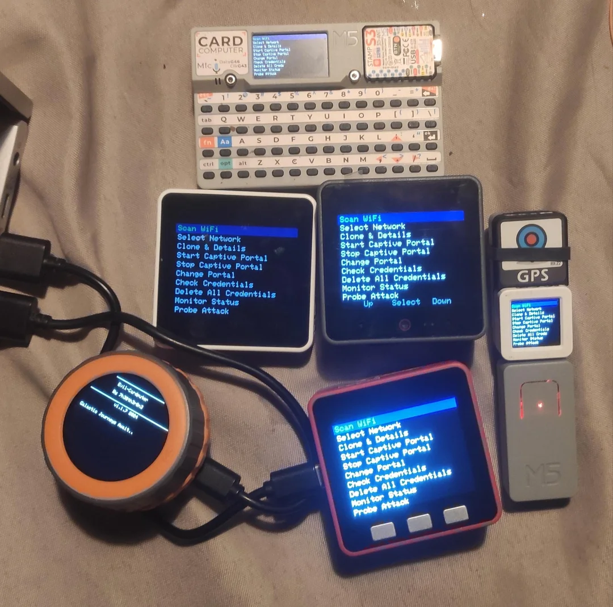

  
# Evil-M5Project v1.3.3 - Colorful Update

<b>Evil-M5Project</b> is an innovative tool developed for ethical testing and exploration of WiFi networks. It harnesses the power of the M5Core2 device to scan, monitor, and interact with WiFi networks in a controlled environment. This project is designed for educational purposes, aiding in understanding network security and vulnerabilities.

> <i>Disclaimer</i>: The creator of Evil-M5Core2 is not responsible for any misuse of this tool. It is intended solely for ethical and educational purposes. Users are reminded to comply with all applicable laws and regulations in their jurisdiction. All files provided with Evil-M5Core2 are designed to be used in a controlled environment and must be used in compliance with all applicable laws and regulations. Misuse or illegal use of this tool is strictly prohibited and not supported by the creator.

#### Booting Screen

  

  

  
With more than 100 references at each boot.

#### Evil-M5Family

If you like this project, support me by buying me a coffee on [Ko-fi](https://ko-fi.com/7h30th3r0n3) !

Or use this affiliate link to buy M5 product [Support the project on M5 shop](https://shop.m5stack.com/?ref=7h30th3r0n3) !

    

 

Join the Evil-M5 discord for help and update 😉: 

## NEW Feature ! from v1.3.3 : Customing Theming, Colorful interface toggle!!!
### Introducing customization features that allow you to make your device truly your own.

1. **Custom Theming**:
   - EvilCardputer's interface colors can now be edited by the user.
     To edit, change the entries in theme.ini in your SD card's root, and color here (https://m5stack.lang-ship.com/howto/m5gfx/color/) is supported.
     Custom colors can be added as well, however you then need to recompile the software yourself.
     
2. **Colorful Interface Toggle**:
   - The theme.ini also toggles "Colorful Interface" on and off, which when enabled, makes some UI elements more interactive, for instance the battery % changing color as it drops, or the captive portal indicator being red for off, and green for on.
     Later optional colorful features will be added to this toggle as well.

If updating to this version, make sure to add the nessecary `selectedTheme=/theme.ini` (or any other theme filename) into your /config/config.txt.
Also make sure to add a `theme.ini` file to your root, there are a few to choose from in the SD-Card-File folder.

## NEW feature ! from v1.3.2 : Handshake Master, Raw Sniffing, Client Sniff & Wi-Fi Channel Visualizer!!!
### Introducing powerful new features that enhance network scanning and analysis capabilities.

1. **Handshake Master**: 
   - Like Wardriving Master, it capture EAPOL frames across multiple Wi-Fi channels using Sniffer Slaves that you can find in slave folder. You can monitor different channels simultaneously from cardputer to ensure no handshakes are missed during your scans.

2. **Wi-Fi Raw Sniffing**: 
   - Sniff everything on a specific Wi-Fi channel. This feature provides you with a detailed view of all network traffic on the selected channel in a pcap, perfect for deep packet analysis.

3. **Sniff Raw Client**: 
   - Analyze the data leaking from clients connected to your evil portal by sniffing the entire network. This functionality helps in understanding how clients interact with the AP and potential leak more informations about the decice that connect to it.

4. **Wi-Fi Channel Visualizer**: 
   - Visualize the usage of the 13 Wi-Fi channels in the 2.4GHz band. This tool helps identify which channels are used near you. 

## NEW feature ! from v1.3.1 : WebUi BadUSB !!!
### You can now plug the device and edit, add or launch badusb script from WebUi panel

Connect the device, go to special pages and you should see Badusb menu, click on a script to start execution. 
You can also edit small txt file in Check SD file.
some others add on Evil-m5core2-menu.

## NEW feature ! from v1.3.0 : Wardriving Master !!!
### You can now use any ESP32 as slave to collect SSID for wigle
By using 14 ESP32 devices, you can monitor all 14 Wi-Fi channels on the 2.4GHz band simultaneously without channel hopping. The **Cardputer** uses GPS to link each received SSID to a CSV file compatible with Wigle.

This slave code is designed to run on any ESP32 and use it as a slave for wardriving in combination with the wardriving master mode on **Cardputer**.
Each ESP32 collects SSIDs of nearby access points (APs) on a specific channel or can hop between configured channels. 
You can add multiple ESP32 devices to improve the accuracy and strength of the scan. Devices with external antennas can enhance performance for wardriving.

## Tested on:
- **AtomS3**: [Buy here](https://s.click.aliexpress.com/e/_DnDXSKJ)
- **AtomS3 Lite**: [Buy here](https://s.click.aliexpress.com/e/_Dm0e95D)
- **ESP32-C3** (with external antenna): [Buy here](https://s.click.aliexpress.com/e/_DD1yibp)
- **WEMOS D1 Mini**: [Buy here](https://s.click.aliexpress.com/e/_DEWPrnz)

## Features:
- **Multi-Device Support**: Add any number of ESP32 devices to increase AP detection and improve coverage.
- **Channel Hopping**: Configure the ESP32 to scan on a specific channel or hop between selected channels.
- **Better Signal Strength**: ESP32 devices with external antennas provide improved signal capture for long-range wardriving.
- **Master-Slave Communication**: Use in combination with the **Cardputer** in wardriving master mode to aggregate and monitor data from multiple ESP32 slaves.
- **GPS Integration**: The **Cardputer** witg GPS link SSID data with geographic coordinates and generate Wigle-compatible CSV files.

## How it Works:
1. Deploy one or more ESP32 devices in slave mode.
2. Each device scans and captures SSID information on designated channels.
3. The data is sent to the **Cardputer**, which aggregates it and reduces missed APs while improving overall scan accuracy and signal strength.

## Hardware Requirements:
- Cardputer with v1.3.0 
- ESP32 devices (e.g., AtomS3, AtomS3 Lite, ESP32-C3, WEMOS D1 Mini)
- External antenna (optional, for enhanced performance)

Here an assembly with 8 esp32-c3 connected in parallel and which scans 1,3,6,9,11,13 in static mode and in hopping for 2 others on 2,4,5,7 and 8,10,12,14 :

 

---

## All Evil-M5Project Features 
- **WiFi Network Scanning**: Identify and display nearby WiFi networks.
- **Network Cloning**: Check information and replicate networks for in-depth analysis.
- **Captive Portal Management**: Create and operate a captive portal to prompt users with a page upon connection.
- **Credential Handling**: Capture and manage portal credentials.
- **Remote Web Server**: Monitor the device remotely via a simple web interface that can provide credentials and upload portals that store files on an SD card.
- **Sniffing probes**: Sniff and store nearby probes on an SD card.
- **Karma Attack**: Try a simple Karma Attack on a captured probe.
- **Automated Karma Attack**: Try Karma Attack on nearby probes automatically.
- **Bluetooth Serial Control**: You can control it with Bluetooth.
- **Wardriving**: Wardriving with Wigle format output on SD.
- **Beacon Spam**: Generate multiple SSIDs around you.
- **Deauther**: Send deauthentication frames and sniff 4-Way handshakes and PMKID.
- **Client Sniff And Deauth**: Sniff clients connected to AP and auto deauth while sniffing EAPOL.
- **EAPOL/Deauth detection**: Detect deauthentication packets, 4-Way handshakes, PMKID, and pwnagotchi near you.
- **Wall Of Flipper**: Detect and save Flipper Zero with Bluetooth enabled near you and detect BLE SPAM.
- **Send Tesla code with RFunit**: Use RFunit to send Tesla codes, mimicking Flipper Zero capabilities.
- **Scan Network and Port**: Perform network and port scans to discover devices and services, checking hosts' status.
- **SSH Shell**: Connect to SSH servers directly from the device, allowing command execution via an on-device shell.
- **Web Crawler**: Crawl websites to extract information, ensuring authorization to crawl before use.
- **PwnGrid**: Spam face and message on pwnagotchi devices nearby, causing a Denial of Screen PWND.
- **Skimmer Detector**: Detect potential Bluetooth skimmers using HC-03, HC-05, and HC-06 modules.
- **BadUSB**: Simulate BadUSB attacks by emulating keyboard/mouse inputs to execute predefined scripts or commands.

 ( What is a Karma attack ? check the blog : https://7h30th3r0n3.fr/does-your-machine-have-a-good-or-bad-karma/)

Features may vary depending on the firmware/device you are using:
| Feature                       | Evil-M5Core2 1.2.2 | Evil-Cardputer v1.2.9 | Evil-M5Core3 1.1.9 | Evil-AtomS3 v1.1.7 | Evil-Face v1.0 |
|-------------------------------|--------------------|-----------------------|--------------------|--------------------|----------------|
| WiFi Network Scanning         | ✅                  | ✅                     | ✅                  | ✅                  | ❌              |
| Network Cloning               | ✅                  | ✅                     | ✅                  | ✅                  | ❌              |
| Captive Portal Management     | ✅                  | ✅                     | ✅                  | ✅                  | ❌              |
| Credential Handling           | ✅                  | ✅                     | ✅                  | ✅                  | ❌              |
| Remote Web Server             | ✅                  | ✅                     | ✅                  | ✅                  | ❌              |
| Sniffing probes               | ✅                  | ✅                     | ✅                  | ✅                  | ❌              |
| Karma Attack                  | ✅                  | ✅                     | ✅                  | ✅                  | ❌              |
| Automated Karma Attack        | ✅                  | ✅                     | ✅                  | ✅                  | ✅              |
| Bluetooth Serial Control      | ✅                  | ❌                     | ❌                  | ❌                  | ❌              |
| Wardriving                    | ✅                  | ✅                     | ✅                  | ✅                  | ❌              |
| Wardriving master             | ❌                  | ✅                     | ❌                  | ❌                  | ❌              |
| Beacon Spam                   | ✅                  | ✅                     | ✅                  | ✅                  | ❌              |
| Deauther                      | ✅                  | ✅                     | ❌                  | ❌                  | ❌              |
| Client Sniff And Deauth       | ✅                  | ✅                     | ❌                  | ❌                  | ❌              |
| EAPOL/Deauth detection        | ✅                  | ✅                     | ✅ (No EAPOL)       | ❌                  | ❌              |
| Wall Of Flipper               | ✅                  | ✅                     | ✅                  | ❌                  | ❌              |
| Send tesla code with RFunit   | ❌                  | ✅                     | ❌                  | ❌                  | ❌              |
| Scan Network and port         | ❌                  | ✅                     | ❌                  | ❌                  | ❌              |
| SSH Shell                     | ❌                  | ✅                     | ❌                  | ❌                  | ❌              |
| Web Crawler                   | ❌                  | ✅                     | ❌                  | ❌                  | ❌              |
| PwnGrid                       | ❌                  | ✅                     | ❌                  | ❌                  | ❌              |
| Skimmer Detector              | ❌                  | ✅                     | ❌                  | ❌                  | ❌              |
| BadUSB                        | ❌                  | ✅                     | ❌                  | ❌                  | ❌              |

## Hardware Requirements

- M5Stack Core2 [M5Stack](https://shop.m5stack.com/products/m5stack-core2-esp32-iot-development-kit-v1-1?ref=7h30th3r0n3) [link AliExpress](https://s.click.aliexpress.com/e/_DBIMh8l)
 (this project is coded with M5Unified, it should work on other M5Stack).
- SD card (fat32 max 16Go, consider 8Go is already more than enough).

Tested working others device :
 M5Cardputer [M5stack](https://shop.m5stack.com/products/m5stack-cardputer-kit-w-m5stamps3?ref=7h30th3r0n3)  [link AliExpress](https://s.click.aliexpress.com/e/_DBzWP6B)
- M5stack fire (with LED effect) [M5stack](https://shop.m5stack.com/products/m5stack-fire-iot-development-kit-psram-v2-7?ref=7h30th3r0n3) 
- M5stack core1 [M5stack](https://shop.m5stack.com/products/atoms3-dev-kit-w-0-85-inch-screen?ref=7h30th3r0n3)
- M5stack AWS [M5stack](https://shop.m5stack.com/products/atoms3-dev-kit-w-0-85-inch-screen?ref=7h30th3r0n3)
- M5stack CoreS3 [M5stack]  [link AliExpress](https://s.click.aliexpress.com/e/_DlFvqIT)

## Installation

1. Connect your M5Core2 to your computer.
2. Open the Arduino IDE and load the provided code.
3. Ensure the Board tutorial from M5 and `IniFile`, `M5Unified`, `TinyGPSPlus`, `ArduinoJson`, `esp8266audio` and `Adafruit_NeoPixel` libraries are installed. Follow these tutorials for guidance on M5 Board tutorial:
   - [Arduino Board Setup](https://docs.m5stack.com/en/arduino/arduino_board)
   - [Arduino Library Installation](https://docs.m5stack.com/en/arduino/arduino_library)
4. Ensure the ESP32 and M5Stack board definitions are installed. **Note:** Errors occur with ESP32 version `3.0.0-alpha3`. Please use ESP32 version `2.1.1` and below.
5. Place the necessary SD file content at the root of SD card. (This is needed to access the `IMG` startup and `sites` folder).
6. (Optional) Edit theme.ini on the SD card to customize your device's color theme. (Only supported for cardputer, other devices to be implemented later) 
7. Ensure to run the script in `utilities` to bypass the ESP32 firmware. Also, add libraries for BadUSB functionality.
8. Ensure that the baud rate is set to `115200`.
9. Ensure that `PSRAM` is disabled in the tools menu.
10. Upload the script to your M5Core2 device.
11. Restart the device if needed.

Warning : for Cardputer you need to change the Flash size to 8MB and the Partition Scheme to 8M with spiffs (3MB APP/1.5MB SPIFFS) or space error may occur.

It's your first time with arduino IDE or something not working correctly? You should check out video section or ask help on the discord ! 

----------------------------------------------------------

## !! Smallest Hacking device in the world Evil-AtomS3 !!
**Meet the smallest hacking tool in the world with all Evil-M5Core2 inside !** 

(With Screen / SDcard / GPS )

  

  
Thx to samxplogs for the video : 

Evil-AtomS3 Functionnality : 

- All Evil-M5Core2 functionality except bluetooth serial.

Consumption:
- Tests show max 200mA draw with 100% brightness and using WiFi/GPS

Hardware Requirement :
- M5AtomS3 [link M5Stack](https://shop.m5stack.com/products/atoms3-dev-kit-w-0-85-inch-screen?ref=7h30th3r0n3) [link AliExpress](https://s.click.aliexpress.com/e/_DeeJXGz)
- ATOMIC GPS Base [link M5Stack](https://shop.m5stack.com/products/atomic-gps-base-m8030-kt?ref=7h30th3r0n3) [link AliExpress](https://s.click.aliexpress.com/e/_Dm2opRj)

Optional: 
- ATOM TailBat(45min) [link](https://shop.m5stack.com/products/atom-tailbat?ref=7h30th3r0n3) 
  
It pretty small so you can also check and control serial on USB from your phone or IDE.

The parasite project still exist but rename to Evil-Face and should be updated in futur too.

----------------------------------------------------------

  
### Screenshots and Media
  
#### Booting Screen

  

  

  
With more than 100 references at each boot.

#### Menu Screen

#### Probes Sniffing

#### Low Battery at boot ( when under 15%)

### Video 
🇫🇷 Le turoriel et la démo en francais réalisé par Samxplogs 🇫🇷 (un trés grand merci à lui) :

Samxplogs tutorial video and demo thx to him :

More demo ? Thx to TalkingSasquatch for making a video about the project : 

## Usage

Follow these steps to efficiently utilize each feature of Evil-M5Core2.

### Menu

#### Scan WiFi

- **Scan Near WiFi**: A fast scan is already made when starting up.

#### Select Network

- **Menu**: Select a network from a list, use left and right keys to navigate and select a network.

#### Clone & Details

- **List Details**: Informations about the selected network. You can clone the SSID in this menu.

#### Start Captive Portal

- **Operate Captive Portal**: With `normal.html` page, a mock WiFi passord page designed to mimic a legitimate error on box.

#### Special Pages
- **/evil-m5core2-menu**: Menu for pages bellow.
- **/credentials**: Lists captured credentials.
- **/uploadhtmlfile**: Provides an upload form to store files on the SD card (for new portal pages and file exfiltration).
- **/check-sd-file**: Provides an index of to check, download and delete files on the SD card.
- **/Change-Portal-Password**: Provides a page to change the password of the deployed access point.

When Captive Portal is ON you can connect to it to acces to 3 fonctionnality protected by password :

- /evil-m5core2-menu
This page is just a menu to provide easy access to others page with authentification form.

- /credentials
This page can list the captured credentials. 

- /uploadhtmlfile
This page provide a upload form that store files in SD card in any folder of the SD to be able to send new portal page, exfiltrate file trough wifi or change the startup image.
please considere to upload file under 1Mo to ensure no lag during the transfert process.

- /check-sd-file
This page provide an index of to check, download and delete files on the SD card.

- /Change-Portal-Password
Provides a page to change the password of the deployed Access Point. Required if attempting a Karma attack on a network with a known password.

  
To prevent unauthorised access of these page they are really simply protected by a password that you need to change in the code. 
To acces to these page use the password form in menu: 

http://192.168.4.1/evil-m5core2-menu

Any other tried page should redirect to the choosen portal. 

#### Stop Captive Portal

- **Deactivate**: Stops the captive portal and DNS.

#### Change Portal

- **Menu**: Choose the portal provided to connecting users. Lists only HTML files.

#### Check Credentials

- **Menu**: To check captured credentials.

#### Delete Credentials

- **Option**: Delete all captured credentials.

### Monitor Status

The Monitor Status feature consists of three static menus that can be navigated using the left and right buttons. Each menu provides specific information about the current status of the system:

#### Menu 1: System Overview
- **Number of Connected Clients**: Displays how many clients are currently connected.
- **Credentials Count**: Shows the number of passwords stored in `credentials.txt`.
- **Current Selected Portal**: Indicates which portal is currently being cloned.
- **Portal Status**: Displays whether the portal is ON or OFF.
- **Provided Portal Page**: Details about the portal page currently in use.
- **Bluetooth**: Displays whether the bluetooth is ON or OFF.

#### Menu 2: Client Information
- **MAC Addresses**: Lists the MAC addresses of all connected clients.

#### Menu 3: Device Status
- **Stack left**: Displays the remaining Stack in the device.
- **Available RAM**: Displays the remaining RAM in the device.
- **Battery Level**: Shows the current battery level.
- **Temperature**: Reports the device's internal temperature.

### Probe Attack 

Send fake random probes near you on all channel. Perfect for counter the Probe Sniffing attack. Press left or right to reduce or increase time delay. (200 ms to 1000ms)

### Probe Sniffing

Probe Sniffing start a probe scan that capture the SSID receive, you can store and reuse then. Restricted to 150 probes max.

### Karma Attack

Same as Probe Sniffing but provide a menu after stopping scan to choose a unique SSID, when SSID is chosen, a portal with the same SSID is deploy, if the original AP is an Open Network and the machine is vulnerable it should connect automaticaly to the network and dependind of the machine can pop up automatically the portal, if a client is present when scan end or stopped, the portal stay open, if not the portal is shutdown. 
(Can be used with password if set on web interface).

### Karma Auto 

Same as Karma Attack but try the first probe seen, if no client connects after 15 seconds the Evil-m5core2 returns to sniffing mode to try another captured probe and continues in a cycle until stopped by the user.
Can also be used with a password if set on the web interface, if you have a password and you don't know on which AP it work you could try it with different probe request to test if karma work and get the SSID.
This feature is inspired by the pwnagotchi project but with probe request and karma attack, you can use both to ensure a full attack of the near devices around you.

You can add SSID on KarmaAutoWhitelist line like this : KarmaAutoWhitelist=notmybox,thisonetoo 

Probe should be ignored and serial message send to notify that this network is whitelisted, it also work on probe sniffing and karma attack.

### Karma Spear 

Same as Karma Auto but with Open SSID captured with wardriving. You can also add custom SSIDs to KarmaList.txt.

### Select Probe

Menu to select a previous captured probe SSID and deploy it. List is restricted to 150 probes.

### Delete Probe

Menu to delete a previous captured probe SSID and deploy it. List is restricted to 150 probes.

### Delete All Probes

Delete ALL previous captured probes. Basically reset probes.txt on SD.

### Brightness

Change the Brightness of the screen. 

### Bluetooth ON/OFF

Switch bluetooth ON or OFF.

### Wardriving

Scan wifi network around and link it to position in Wigle format, you can upload it to wigle to earn point and generate KLM file for Google earth.
You need a GPS for this. 

Tested device working on Core2/Fire/AtomS3 :
- ATOMIC GPS Base [link M5Stack](https://shop.m5stack.com/products/atomic-gps-base-m8030-kt?ref=7h30th3r0n3) [link AliExpress](https://s.click.aliexpress.com/e/_DnqzH61)

Tested device working on Core2/Fire:
- GPS Module with Internal & External Antenna [link M5Stack](https://shop.m5stack.com/products/gps-module?ref=7h30th3r0n3)

Tested device working on Core2/Fire/CoreS3/Cardputer :
- Mini GPS/BDS Unit [link M5Stack](https://shop.m5stack.com/products/mini-gps-bds-unit?ref=7h30th3r0n3)

PIN : 
- PIN for Core2 : 
use RX2/TX2 | GND | 5v or 3.3v

GPIO 13

GPIO 14

- PIN for Fire on C-PORT :

GPIO 16

GPIO 17

### Beacon Spam

Beacon Spam create multiple networks on all channels to render multiples SSIDs in wifi search and sniffing equipement.
You can use custom Beacon with config file. 

### Wall of Flipper : You can run it but you can't hide !!!! 

Based on an original idea from K3YOMI, thanks to him for the fantastic work ! 

You absolutely must see the original project here from which I took inspiration and from which I used the code :

https://github.com/K3YOMI/Wall-of-Flippers

Flipper Zero detection via bluetooth :

Discover Flipper Zero Devices :
- Discovering Flipper Name
- Discovering Flipper Mac Address and if it's spoofed (normal/spoofed)
- Discovering Flipper color (Detection of Transparent, White, & Black Flipper)
- Saving Flipper Zero Devices Discovered near you on SD Card. 

Capability to Identify Potential Bluetooth Advertisement Attacks from Flipper and Other Devices :
- Suspected Advertisement Attacks
- iOS Popup Advertisement Attacks
- Samsung and Android BLE Advertisement Attacks
- Windows Swift Pair Advertisement Attacks
- LoveSpouse Advertisement Attacks (Denial of Pleasure)

## Client Sniff And Deauth
### You can now sniff connected client and send deauthentification frame automatically! 

### !! Warning !! You need to bypass the esp32 firmware with scripts in utilities before compiling or deauth is not working due to restrictions on ESP32 firmware

Based on an original idea from evilsocket the pwnagotchi 

You absolutely must see the original project here from which I took inspiration:

[https://github.com/evilsocket/pwnagotchi](https://github.com/evilsocket/pwnagotchi)

On screen:
- AP: Number of APs near you 
- C : Current Channel
- H : Numbers of new PCAP created ( at least one EAPOL and beacon frame)
- E : Numbers of EAPOL packets captures
- D : 0 = no deauth only sniffing / 1 = active deauth
- DF: Fast Mode 

Left Button : ON/OFF deauth 

middle : back to menu 

right Button : Fast/slow mode 

So what ? 

It does :
- Scan for near AP
- Sniff if client is connected
- Send broadcast deauth frame to each AP which have client
- Send spoofed deauth frame for each client
- Sniff EAPOL at same time
- Loop at Scan near AP

## Deauther 
### You can now send deauthentification frame ! 
### !! Warning !! You need to bypass the esp32 firmware with scripts in utilities before compiling or deauth is not working due to restrictions on ESP32 firmware
 
Based on an original idea from spacehuhn the deauther 

You absolutely must see the original project here from which I took inspiration:

[https://github.com/SpacehuhnTech/esp8266_deauther](https://github.com/SpacehuhnTech/esp8266_deauther)

Evil-M5core2 is now able to send deauthentification frames and you can sniff the EPAOL in same time.

Just select the network and go to deauther, answer asked question, and start to deauth and sniff at same time !

Special thanks to Aro2142 and n0xa for the help and work. 

## EAPOL Sniffing
### You can now capture EAPOL (4-wayhandshakes and PMKID) ! 

Based on an original idea from G4lile0 the Wifi-Hash-Monster.

You absolutely must see the original project here from which I took inspiration:

[https://github.com/G4lile0/ESP32-WiFi-Hash-Monster
](https://github.com/G4lile0/ESP32-WiFi-Hash-Monster)

- Channel : Current Channel
- Mode : Static : Stay on same channel / Auto: Hopping trough all channel
- PPS : Packets Per Second on the channel (if no activities on the channel the PPS could be locked to the last know number of packets because the refresh occur when a packet is reveived)
- H : Numbers of new PCAP created ( at least one EAPOL and beacon frame)
- EAPOL : Numbers of EAPOL packets captures
- DEAUTH : Numbers of Deauth seen
- RSSI : The transmission power (gives an idea of ​​the distance from the transmitter)

If a EAPOL packet is detected, its stored in a pcap file with the mac address of the AP and a beacon frames wih the BSSID.
 You can crack a Wifi password with a 4-way handshakes or a PMKID with Aircrack-ng or Hashcat.

A python tool to process multiple pcap to hashcat format is provided in utilities.

Detect deauthentication packets near you, when a machine disconnects from an access point, it sends a deauthentication packet to close the connection, 
deauthentication packets can also be spoofed to disconnect the device and attacker use automatic reconnection to sniff the 4-way handshake, 
a lot of deauthentication packets are not normal and should be considered as a possible Wi-Fi attack. 

This feature also detects nearby pwnagotchi by printing the name and number of pwned network that it get, 
in this way you can know if you are under attacked.

## PwnGrid Spam 
### You can now spam with face and message near pwnagotchi

Designed to spam face and name on all pwnagotchi devices nearby and can be used to causing a DoSPWND (Denial Of Screen PWND part).
You can change the face and message sended in a text file. 

REMEMBER TO PUT THE FILE IN CONFIG FOLDER : https://github.com/7h30th3r0n3/Evil-M5Core2/blob/main/SD-Card-File/config/pwngridspam.txt

Perfect for showcasing at events like DEFCON or BlackHat.😜

It's also available standalone on any esp32 here : https://github.com/7h30th3r0n3/PwnGridSpam

part of the code have been taken and refactored from https://github.com/viniciusbo/m5-palnagotchi

## Web Crawler 
### You can now crawl websites and extract useful information!

### !! Warning !! Ensure you are authorized to crawl the website before using this feature.

On screen:
- URL: The website URL being crawled
- Pages: current of page crawled
- Dictonnary on SD card so it could be swaped
- Scrolling list at the end to see all the content crawled

## Connect to SSH 
### You can now connect to SSH servers directly from the device!

On screen:
- A real SSH Shell with CTRL+C
- Can be used from the Scan Hosts after menu

## Scan Network and port 
### You can now scan networks and ports to discover devices and services!

It does:
- ARP broadcast on all the network 
- Check Hosts up
- List them to let you choose actions (Scan ports / SSH connect / Web Crawling)

##  Send tesla code
### You can now send Tesla codes using the RFunit!

On screen:
- Status: Transmission status (e.g., Sending, Finished)

( This functionnality has been not totally tested, it send the same signal than the flipper zero best-tesla-opener )

## Skimmer Detector
### Detect Bluetooth-based skimmers with ease!

The Skimmer Detector feature helps identify potential Bluetooth-based skimmers by scanning for common Bluetooth modules such as HC-03, HC-05, and HC-06. While detection does not guarantee the presence of a skimmer, it's a useful tool for identifying suspicious devices.

**How it works:**
- Initiate a Bluetooth scan from the device.
- View a list of detected devices with their IDs and signal strength.
- If a suspicious device is near an alert appear.

**Note:** Detection of a device does not necessarily mean it is a skimmer, but caution is advised.

## BadUSB
### You can now use BadUSB attacks directly from the device!

This feature allows the device to act as a BadUSB, emulating keyboard inputs to execute predefined scripts or commands on a connected computer. Ideal for security testing and demonstrations.

**Usage:**
- Prepare your script in a text file and upload it to the `BadUsbScript` folder on the device.
- Activate the BadUSB mode from the menu and select the script to execute or change the layout.
- 20 Scripts are provided but you can add more.

**Caution:** Use responsibly and ensure you have permission before executing any scripts.

## Flipper Zero Friend ? 
### **Yes, it is !!!**

Evil-M5Core2 sends messages via serial for debugging purposes and message when you navigate on the Core2, you can use the serial app on Flipper to see these messages.
Plug your flipper with :

- On flipper : 

PIN 13/TX

PIN 14/RX 

- On M5Core2 :

PIN G3/RXD0

PIN G1/TXD0

### Serial Command 

You can control almost all functionnaly with serial command:

Available Commands:
- scan_wifi - Scan WiFi Networks
- select_network <index> - Select WiFi <index>
- change_ssid <max 32 char> - change current SSID
- set_portal_password <password min 8> - change portal password
- set_portal_open  - change portal to open
- detail_ssid <index> - Details of WiFi <index>
- clone_ssid - Clone Network SSID
- start_portal - Activate Captive Portal
- stop_portal - Deactivate Portal
- list_portal - Show Portal List
- change_portal <index> - Switch Portal <index>
- check_credentials - Check Saved Credentials
- monitor_status - Get current information on device
- probe_attack - Initiate Probe Attack
- stop_probe_attack - End Probe Attack
- probe_sniffing - Begin Probe Sniffing
- stop_probe_sniffing - End Probe Sniffing
- list_probes - Show Probes
- select_probes <index> - Choose Probe <index>
- karma_auto - Auto Karma Attack Mode stop automatically when successfull

  
# Acknowledgements

- [@SpacehuhnTech](https://github.com/SpacehuhnTech) for the deauther bypass and for the fantastic work that is really inspiring.
- [@evilsocket](https://github.com/evilsocket) for the concept of pwnagotchi and pwngrid.
- [@G4lile0](https://github.com/G4lile0) for the wifi-hash-monster.
- [@K3YOMI](https://github.com/K3YOMI) for the Wall Of Flipper.
- [@pr3y](https://github.com/pr3y) for help and Bruce code.
- [@bmorcelli](https://github.com/bmorcelli) for the help and Bruce code too.
- [@justcallmekoko](https://github.com/justcallmekoko) for the Marauder.
- [@Talking Sasquach](https://www.youtube.com/@TalkingSasquach) for creating video content about the project.
- [@Sam X Plogs](https://www.youtube.com/@samxplogs) for creating video content about the project.
- [@dagnazty](https://github.com/dagnazty) for the fantastic work on M5dial. 
- [@LaikaSpaceDawg](https://github.com/LaikaSpaceDawg) for the work on the code.

and to all Beta-testers on the discord : 

- [@KamiLocura] 
- [@Skedone] 
- [@toxiccpappii] 
- [@OarisKiller] 
- [@hosseios] 
- [@BrownNoise] 
- [@DAKKA] 
- [@KNAX] 

## !! Adopt a Parasite !!

Your Evil-Core2 or Flipper Zero feels lonely?
  
**Add a small parasite to it !!!**

  
He can also be used standalone but he needs a host for energy like a phone or a powersupply to survive or he die. 

Parasite Functionnality : 

- **Cute** (yes it's a useful feature to survive).
- **Accelerometer interaction** (don't shake it or it get mad).
- **AutoKarmaAttack** when face is pressed ( when a karma attack is successfull your little parasiste tell the name of the SSID in a textbubble until the next karma successfull or death).
- **Whitelist** (hardcoded, need to be change by compiling the code again)

(For the moment no portal is sent it just tests if a device connect).

Hardware Requirement :
- M5AtomS3
  
Software Requirement :
This little parasite use m5stack-avatar to render face, donwload avatar librairie before compile.
- https://github.com/meganetaaan/m5stack-avatar

It pretty small so you can also check serial on USB to get information.

## Semi Evil M5Dial

### Features
- **Captive Portal**: Start a simple Wi-Fi captive portal to interact with connected clients.
- **SSID Selection**: Browse and select SSIDs stored in the device.
- **Karma Attack**: Automatically respond to probe requests by creating rogue APs with detected SSIDs.
- **About Screen**: Information about the project and contributors.

### Getting Started

#### Requirements
- **Legacy Arduino IDE (1.8.x)**: Download from [Arduino.cc](https://www.arduino.cc/en/software).
- **ESP32 SPIFFS Tool**: Download from [ESP32FS Plugin GitHub](https://github.com/me-no-dev/arduino-esp32fs-plugin/releases).

**or**

- **M5Dial SPIFFS Uploader**: Download from [Github](https://github.com/dagnazty/M5Dial_SPIFFS_Uploader/releases)

#### Required Libraries

Before you begin, make sure you have installed the following libraries in the Arduino IDE:

1. **M5Stack Unified (M5Unified)**
   - **Description**: Required to work with M5Stack devices, including the M5Dial. It handles the initialization and control of the display, buttons, and other peripherals.
   - **Installation**: Available through the Arduino Library Manager.
   - **How to Install**: 
     1. Open Arduino IDE.
     2. Go to `Sketch > Include Library > Manage Libraries...`.
     3. Search for "M5Unified" and install it.

2. **ESP32 Arduino Core**
   - **Description**: Core library for ESP32 microcontroller, supporting all ESP32-based devices, including Wi-Fi, Bluetooth, and other peripherals.
   - **Installation**: Requires adding the ESP32 board URL to Arduino IDE and installing the board package.
   - **How to Install**:
     1. Go to `File > Preferences`.
     2. In the "Additional Board Manager URLs" field, add: `https://dl.espressif.com/dl/package_esp32_index.json`.
     3. Go to `Tools > Board > Boards Manager...`.
     4. Search for "esp32" and install the package by Espressif Systems.

3. **ArduinoJson**
   - **Description**: A library to parse and generate JSON data, used to handle configuration data stored in JSON format on the M5Dial.
   - **Installation**: Available through the Arduino Library Manager.
   - **How to Install**:
     1. Open Arduino IDE.
     2. Go to `Sketch > Include Library > Manage Libraries...`.
     3. Search for "ArduinoJson" and install it.

#### Installation - Arduino Legacy
1. Download and install the Legacy Arduino IDE (1.8.x).
2. Install the ESP32 SPIFFS tool:
    - Place the `ESP32FS` folder in the `tools` directory inside your Arduino sketchbook location. If the `tools` directory doesn’t exist, create it.
    - You can find the Arduino sketchbook location in the Arduino IDE under `File > Preferences`.
3. Clone or download this repository to your local machine.
4. Open the project in the Arduino IDE by selecting `File > Open`, then choose the `.ino` file from the project directory.

#### Uploading Files to SPIFFS
1. Open the sketch in the Arduino IDE.
2. Copy the `m5dial-data` folder from this project to the sketch directory.
3. From the Arduino IDE, select `Tools > ESP32 Sketch Data Upload`.
4. Wait for the upload to complete.

#### Installation - M5Dial SPIFFS Uploader
1. Download and install `M5Dial_SPIFFS_Uploader_Setup.exe`.
2. Connect your M5Dial device to your PC via a USB cable.
3. Run the `M5Dial_SPIFFS_Uploader.exe`.
4. From the "COM Port" dropdown, select the correct COM port for your device.
5. Click the `Connect` button. The tool will attempt to detect the flash size of your device.

### Creating a SPIFFS Image
1. After successfully connecting to the device, the `Create SPIFFS Image` button will be enabled.
2. Click `Create SPIFFS Image`.
3. Choose the `m5dial-data` folder.
4. Save the SPIFFS image to your desired location.

### Uploading the SPIFFS Image
1. Click `Upload SPIFFS Image`.
2. Select the SPIFFS image you created earlier.
3. Wait for the upload to complete.

#### Usage
- **Start Captive Portal**: From the menu, select "Start Portal" to create a simple Wi-Fi access point.
- **SSID Selection**: Choose from stored SSIDs to set the current SSID for the captive portal.
- **Karma Attack**: Launch the Karma attack by selecting "Start Karma" from the menu.
- **About Screen**: View project information by selecting "About" from the menu.

----------------------------------------------------------

# License

MIT License

Copyright (c) 2023 7h30th3r0n3

Permission is hereby granted, free of charge, to any person obtaining a copy
of this software and associated documentation files (the "Software"), to deal
in the Software without restriction, including without limitation the rights
to use, copy, modify, merge, publish, distribute, sublicense, and/or sell
copies of the Software, and to permit persons to whom the Software is
furnished to do so, subject to the following conditions:

The above copyright notice and this permission notice shall be included in all
copies or substantial portions of the Software.

THE SOFTWARE IS PROVIDED "AS IS", WITHOUT WARRANTY OF ANY KIND, EXPRESS OR
IMPLIED, INCLUDING BUT NOT LIMITED TO THE WARRANTIES OF MERCHANTABILITY,
FITNESS FOR A PARTICULAR PURPOSE AND NONINFRINGEMENT. IN NO EVENT SHALL THE
AUTHORS OR COPYRIGHT HOLDERS BE LIABLE FOR ANY CLAIM, DAMAGES OR OTHER
LIABILITY, WHETHER IN AN ACTION OF CONTRACT, TORT OR OTHERWISE, ARISING FROM,
OUT OF OR IN CONNECTION WITH THE SOFTWARE OR THE USE OR OTHER DEALINGS IN THE
SOFTWARE.

